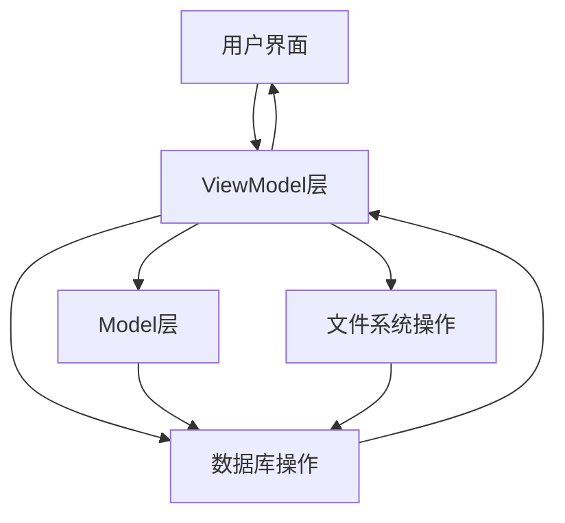
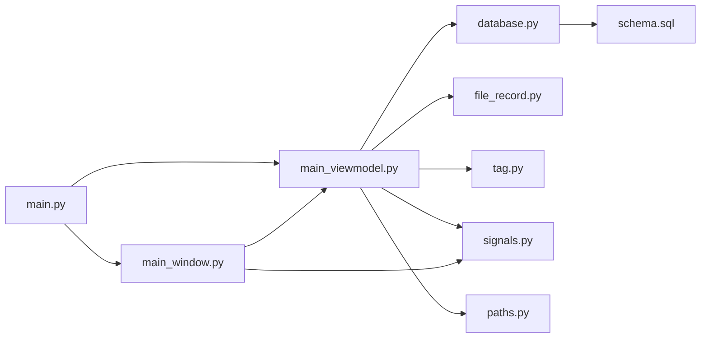

# 本地文件多标记交叉管理系统设计报告

## 1. 项目背景

### 1.1 项目概述

随着数字化时代的到来，个人和企业的本地文件数量呈爆炸式增长，传统的文件管理方式（基于单一路径的文件夹结构）已难以满足现代用户的需求。用户经常面临以下痛点：

- 文件分类单一，难以实现多维度管理
- 文件位置固定，跨类别文件难以快速定位
- 缺乏灵活的标记和搜索机制
- 文件元数据管理困难

本项目旨在开发一款**本地文件多标记交叉管理系统**，通过多对多网状标记体系实现文件的灵活分类与快速定位，同时为后续联网自动分类、多设备同步预留架构，兼顾初代落地性与长期扩展性。

### 1.2 核心目标

- **初代目标**：实现本地文件（办公文档、图片、视频、文本、压缩包、音频）的信息导入、网状标记、交叉搜索，支持规则导入/导出，性能达标50000文件<1秒搜索，适配主流操作系统，保证开发规范与代码质量，同时完善用户交互体验，满足日常文件管理的便捷性需求。

- **长期目标**：平滑升级为"联网AI自动分类+多设备配置同步+文件夹级配置联动"的系统，依托预留的插件化接口实现功能扩展。

## 2. 需求分析

### 2.1 功能需求

| 功能模块 | 具体需求 | 优先级 |
|---------|---------|--------|
| 文件管理 | 支持单文件/多文件夹导入，导入前提供文件预览，支持拖拽导入 | 高 |
| 文件管理 | 文件变更监测，实时监测文件移动、删除、重命名、修改操作 | 高 |
| 文件管理 | 支持图片、PDF、TXT、MD格式文件的轻量内置预览 | 中 |
| 文件管理 | 实现文件软删除，支持一键恢复操作 | 高 |
| 标记管理 | 支持最多3级层级标记体系，界面以树形结构展示 | 高 |
| 标记管理 | 支持标记的新增、修改、删除、重命名，支持批量操作 | 高 |
| 标记管理 | 提供标记云图、标记使用频率统计图表 | 中 |
| 搜索与筛选 | 支持按文件名称、后缀、大小、时间范围筛选，实现标记组合逻辑 | 高 |
| 搜索与筛选 | 确保50000文件搜索响应时间<1秒，保留最近10条搜索历史 | 高 |
| 交互与权限 | 支持文件列表右键菜单，设置常用功能快捷键 | 高 |
| 交互与权限 | 支持批量导出文件列表为CSV格式 | 中 |
| 交互与权限 | 支持本地多用户隔离，每个用户对应独立的数据库和配置 | 中 |

### 2.2 非功能需求

| 需求类别 | 具体要求 | 优先级 |
|---------|---------|--------|
| 性能要求 | 50000文件分批次异步导入，无内存泄漏，导入完成时间≤30分钟 | 高 |
| 性能要求 | 50000文件搜索响应时间<1秒，10000文件搜索响应时间<0.5秒 | 高 |
| 性能要求 | 系统运行过程中无明显卡顿，文件变更监测响应及时 | 高 |
| 兼容性 | 支持Windows 10/11、macOS 12+、Ubuntu 20.04 LTS+（Linux可选） | 中 |
| 安全性 | 所有数据存储在本地SQLite数据库中，保障数据安全 | 高 |
| 可扩展性 | 预留插件化接口，支持后续功能扩展 | 中 |
| 可用性 | 界面友好，操作简单直观，支持拖拽操作 | 高 |

## 3. 系统架构设计

### 3.1 架构风格

本项目采用**MVVM（Model-View-ViewModel）**分层架构，结合本地文件系统和SQLite数据库，实现文件管理与标记系统的高效交互。

### 3.2 架构组件

| 层级 | 组件 | 职责 | 技术实现 |
|------|------|------|----------|
| 视图层（View） | MainWindow及自定义组件 | 界面展示和用户交互 | PyQt5 |
| 视图模型层（ViewModel） | MainViewModel | 业务逻辑和数据库操作 | Python |
| 视图模型层（ViewModel） | MainSignals | UI更新信号定义 | PyQt5 Signals |
| 模型层（Model） | FileRecord、Tag | 数据类定义 | Python |
| 数据访问层 | database.py | 数据库连接与操作 | SQLite |
| 工具层 | paths.py、logging_setup.py | 路径管理和日志配置 | Python |

### 3.3 系统流程图



## 4. 模块划分

### 4.1 核心模块

| 模块名称 | 所在目录 | 主要职责 | 文件组成 |
|---------|---------|---------|----------|
| 主应用模块 | src/ | 应用入口 | main.py |
| 核心配置模块 | src/app/core/ | 日志配置、路径管理、设置加载 | logging_setup.py、paths.py、settings.py |
| 数据库模块 | src/app/db/ | 数据库连接与操作、表结构定义 | database.py、schema.sql |
| 数据模型层 | src/app/model/ | 定义文件记录和标签数据类 | file_record.py、tag.py |
| 视图模型层 | src/app/viewmodel/ | 核心业务逻辑、UI更新信号 | main_viewmodel.py、signals.py |
| 视图层 | src/app/ui/ | 主窗口及所有UI组件 | main_window.py |

### 4.2 模块依赖关系



## 5. 接口设计

### 5.1 主要类接口

| 类名 | 所在文件 | 主要方法 | 功能描述 |
|------|---------|---------|----------|
| `MainViewModel` | main_viewmodel.py | `import_files()`, `add_tag()`, `search_files()` | 核心业务逻辑，处理文件导入、标记管理、搜索等操作 |
| `MainWindow` | main_window.py | `setup_ui()`, `connect_signals()`, `update_file_list()` | 主窗口UI初始化和事件处理 |
| `FileRecord` | file_record.py | `from_dict()`, `to_dict()` | 文件记录数据类 |
| `Tag` | tag.py | `from_dict()`, `to_dict()` | 标签数据类 |
| `Database` | database.py | `connect()`, `execute()`, `get_files()` | 数据库连接和操作 |

### 5.2 信号接口

| 信号名称 | 所在文件 | 参数 | 功能描述 |
|---------|---------|------|----------|
| `files_imported` | signals.py | `files: List[FileRecord]` | 文件导入完成信号 |
| `tags_updated` | signals.py | `tags: List[Tag]` | 标签更新信号 |
| `search_completed` | signals.py | `results: List[FileRecord]` | 搜索完成信号 |
| `file_deleted` | signals.py | `file_id: int` | 文件删除信号 |

## 6. 数据结构设计

### 6.1 数据库表结构

| 表名 | 字段名 | 数据类型 | 约束 | 描述 |
|------|--------|---------|------|------|
| `files` | `id` | `INTEGER` | `PRIMARY KEY AUTOINCREMENT` | 文件ID |
| `files` | `file_name` | `TEXT` | `NOT NULL` | 文件名 |
| `files` | `full_path` | `TEXT` | `NOT NULL` | 文件完整路径 |
| `files` | `file_size` | `INTEGER` | `NOT NULL` | 文件大小（字节） |
| `files` | `file_hash` | `TEXT` | `NOT NULL` | 文件SHA256哈希值 |
| `files` | `file_type` | `TEXT` | `NOT NULL` | 文件类型 |
| `files` | `create_time` | `TIMESTAMP` | `DEFAULT CURRENT_TIMESTAMP` | 创建时间 |
| `files` | `modify_time` | `TIMESTAMP` | `NOT NULL` | 修改时间 |
| `files` | `is_deleted` | `INTEGER` | `DEFAULT 0` | 是否删除（软删除） |
| `tags` | `id` | `INTEGER` | `PRIMARY KEY AUTOINCREMENT` | 标签ID |
| `tags` | `tag_name` | `TEXT` | `NOT NULL` | 标签名称 |
| `tags` | `parent_id` | `INTEGER` | `REFERENCES tags(id)` | 父标签ID |
| `tags` | `is_deleted` | `INTEGER` | `DEFAULT 0` | 是否删除（软删除） |
| `file_tag_relation` | `file_id` | `INTEGER` | `REFERENCES files(id)` | 文件ID |
| `file_tag_relation` | `tag_id` | `INTEGER` | `REFERENCES tags(id)` | 标签ID |
| `file_tag_relation` | `PRIMARY KEY` | - | `(file_id, tag_id)` | 联合主键 |
| `search_history` | `id` | `INTEGER` | `PRIMARY KEY AUTOINCREMENT` | 历史ID |
| `search_history` | `query` | `TEXT` | `NOT NULL` | 搜索查询JSON |
| `search_history` | `timestamp` | `TIMESTAMP` | `DEFAULT CURRENT_TIMESTAMP` | 搜索时间 |
| `file_notes` | `file_id` | `INTEGER` | `PRIMARY KEY REFERENCES files(id)` | 文件ID |
| `file_notes` | `note` | `TEXT` | `NOT NULL` | 文件备注 |
| `file_imprints` | `id` | `INTEGER` | `PRIMARY KEY AUTOINCREMENT` | 印记ID |
| `file_imprints` | `file_id` | `INTEGER` | `REFERENCES files(id)` | 文件ID |
| `file_imprints` | `content` | `TEXT` | `NOT NULL` | 印记内容 |
| `file_imprints` | `timestamp` | `TIMESTAMP` | `DEFAULT CURRENT_TIMESTAMP` | 印记时间 |

### 6.2 数据类结构

#### FileRecord 类
```python
class FileRecord:
    def __init__(self, id=None, file_name=None, full_path=None, file_size=None, 
                 file_hash=None, file_type=None, create_time=None, modify_time=None, 
                 is_deleted=False):
        self.id = id
        self.file_name = file_name
        self.full_path = full_path
        self.file_size = file_size
        self.file_hash = file_hash
        self.file_type = file_type
        self.create_time = create_time
        self.modify_time = modify_time
        self.is_deleted = is_deleted
```

#### Tag 类
```python
class Tag:
    def __init__(self, id=None, tag_name=None, parent_id=None, is_deleted=False):
        self.id = id
        self.tag_name = tag_name
        self.parent_id = parent_id
        self.is_deleted = is_deleted
```

## 7. 技术选型

### 7.1 核心技术栈

| 类别 | 技术 | 版本 | 选型理由 |
|------|------|------|----------|
| 开发语言 | Python | 3.12+ | 语法简洁，生态丰富，跨平台支持 |
| GUI框架 | PyQt5 | ≥5.15.0 | 功能强大，界面美观，扩展性好，社区成熟 |
| 数据库 | SQLite | 3.37.0+ | 轻量本地数据库，无需额外安装，便于后续迁移 |
| 文件监测 | watchdog | ≥4.0.1 | 轻量、跨平台，实现文件实时变更监测 |
| 图像处理 | Pillow | ≥9.0.0 | 图片文件信息读取、内置预览支持 |
| 类型提示 | typing_extensions | ≥4.0.0 | 增强类型注解，提高代码可读性 |

### 7.2 依赖库清单

| 库名称 | 版本要求 | 用途 | 是否必需 |
|---------|---------|------|----------|
| PyQt5 | ≥5.15.0 | GUI界面开发、交互逻辑实现 | 必需 |
| PyQt5-sip | ≥12.13.0 | PyQt5依赖，确保界面组件正常运行 | 必需 |
| sqlite3 | Python内置（3.37.0+） | 本地数据库操作 | 必需 |
| watchdog | ≥4.0.1 | 文件变更实时监测 | 必需 |
| pillow | ≥9.0.0 | 图片文件信息读取、内置预览 | 预留（初代可选） |
| pymupdf | ≥1.24.0 | PDF文件元数据读取、内置预览 | 预留（初代可选） |
| python-docx | ≥0.8.11 | Word文件元数据读取 | 预留（初代可选） |

## 8. 实现计划

### 8.1 开发阶段划分

| 阶段 | 任务 | 时间估计 |
|------|------|----------|
| 阶段1：基础架构搭建 | 项目初始化、目录结构创建、依赖安装 | 1天 |
| 阶段2：数据库设计与实现 | 数据库表结构设计、数据库操作模块开发 | 2天 |
| 阶段3：核心数据模型实现 | FileRecord、Tag数据类开发 | 1天 |
| 阶段4：视图模型层开发 | MainViewModel核心业务逻辑实现 | 3天 |
| 阶段5：UI界面开发 | MainWindow及自定义组件开发 | 3天 |
| 阶段6：功能集成与测试 | 各模块集成、功能测试、性能优化 | 2天 |
| 阶段7：打包与发布 | 应用打包、文档编写、发布准备 | 1天 |

### 8.2 关键里程碑

1. **数据库设计完成**：完成所有表结构设计和初始化脚本
2. **核心功能实现**：完成文件导入、标记管理、搜索筛选等核心功能
3. **UI界面完成**：完成主窗口和所有UI组件的开发
4. **性能测试通过**：确保50000文件搜索响应时间<1秒
5. **应用打包完成**：生成可执行文件，支持跨平台运行

## 9. 测试策略

### 9.1 测试类型

| 测试类型 | 测试内容 | 测试方法 |
|---------|---------|----------|
| 单元测试 | 各个模块的独立功能测试 | 使用Python unittest框架 |
| 集成测试 | 模块间交互和数据流测试 | 模拟用户操作流程 |
| 性能测试 | 大文件量导入和搜索性能测试 | 生成50000个测试文件进行测试 |
| 兼容性测试 | 不同操作系统和Python版本的兼容性 | 在Windows、macOS、Linux上测试 |
| 用户体验测试 | 界面操作流畅度和易用性测试 | 邀请用户进行操作测试 |

### 9.2 测试用例设计

| 测试用例 | 预期结果 | 测试步骤 |
|---------|---------|----------|
| 单文件导入 | 文件成功导入数据库，显示在文件列表中 | 点击导入按钮，选择单个文件 |
| 多文件批量导入 | 所有文件成功导入，无重复记录 | 选择多个文件进行导入 |
| 标记创建与管理 | 标记成功创建，支持层级结构 | 创建父标记和子标记 |
| 文件标记关联 | 文件成功关联到指定标记 | 拖拽文件到标记树节点 |
| 多条件搜索 | 搜索结果符合条件，响应时间<1秒 | 输入搜索关键词和筛选条件 |
| 文件预览 | 支持图片和文本文件的内置预览 | 选择不同类型的文件查看预览 |
| 软删除与恢复 | 文件标记为删除状态，可恢复 | 删除文件后在回收站中恢复 |
| 性能测试 | 50000文件导入时间≤30分钟，搜索响应时间<1秒 | 生成大量测试文件进行测试 |

## 10. 风险评估与应对策略

| 风险 | 可能性 | 影响程度 | 应对策略 |
|------|---------|---------|----------|
| 大文件导入内存溢出 | 中 | 高 | 实现分批次异步导入，限制每批次处理文件数量 |
| 数据库性能瓶颈 | 中 | 高 | 优化数据库索引，使用预编译语句，定期清理数据 |
| 文件路径变更导致关联失效 | 高 | 高 | 使用文件SHA256哈希值作为唯一标识，实现文件追踪 |
| 跨平台兼容性问题 | 中 | 中 | 针对不同操作系统进行测试，使用跨平台库 |
| 用户操作错误导致数据丢失 | 低 | 高 | 实现软删除机制，提供数据备份功能 |

## 11. 结论与展望

### 11.1 项目价值

本项目通过创新的多标记交叉管理模式，解决了传统文件管理系统的局限性，为用户提供了更加灵活、高效的文件管理方案。系统采用现代化的MVVM架构，结合SQLite数据库和PyQt5 GUI框架，实现了高性能、跨平台的文件管理功能。

### 11.2 未来展望

1. **AI智能分类**：引入机器学习算法，实现文件自动分类和标记推荐
2. **多设备同步**：支持云端同步，实现多设备间的文件标记信息共享
3. **插件化扩展**：开发插件系统，支持功能模块化扩展
4. **文件夹级配置联动**：实现文件夹与标记的双向关联
5. **高级搜索功能**：支持内容搜索、自然语言查询等高级搜索能力

通过持续的技术迭代和功能扩展，本系统有望成为用户日常文件管理的得力助手，为数字化时代的文件管理提供更加智能、高效的解决方案。